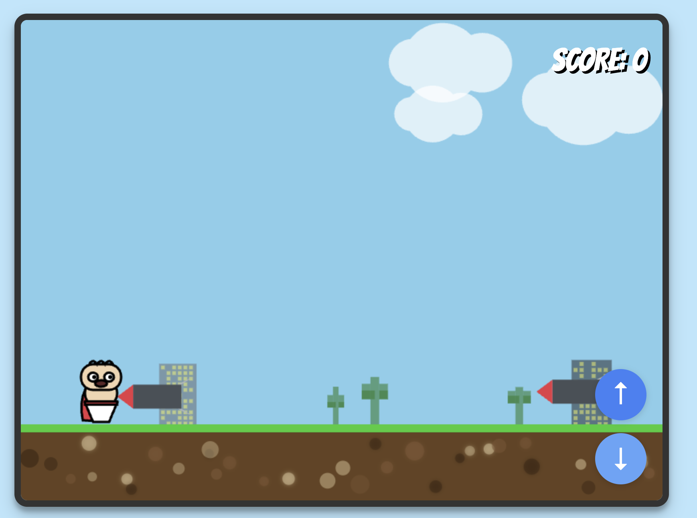

# Captain Underpants Adventure

A fun 2D endless runner game where you control Captain Underpants as he runs through a city landscape, jumping and ducking to avoid missiles while collecting points!



## Game Overview

Captain Underpants Adventure is a feature-rich 2D endless runner game built with HTML5 Canvas and modern JavaScript. Players control the infamous Captain Underpants character as he runs through a dynamic city environment with parallax scrolling backgrounds, weather effects, and day/night cycles. The game features increasing difficulty as you progress, making it both challenging and entertaining for players of all ages.

The game is inspired by the popular Chrome dinosaur game but with a humorous twist featuring the beloved children's book character, Captain Underpants. The objective is simple: avoid missiles and survive as long as possible while accumulating points.

## Features

### Core Gameplay
- **Dual Controls**: Jump over or duck under obstacles for varied gameplay
- **Progressive Difficulty**: Game speed gradually increases the longer you play
- **Scoring System**: Track your high scores and compete on leaderboards
- **Particle Explosion Effects**: Dramatic explosions when Captain Underpants collides with missiles
- **Smooth Physics**: Realistic gravity and cape physics with dynamic animations

### Visual Effects
- **Dynamic Cape Animation**: Cape reacts to jumping, ducking, and running with fluid physics
- **Parallax Scrolling**: Multi-layered background with buildings, trees, and cacti moving at different speeds
- **Night Mode**: Dynamic lighting changes (activates randomly during score 20-40)
- **Weather Effects**: Rain with lightning strikes (activates randomly during score 20-40)
- **Animated Ground**: Moving pebbles, stones, and occasional worms for added detail

### Audio
- **Sound Effects**: Jump sounds, collision explosions, and score milestone beeps
- **Web Audio API**: Procedurally generated sounds for performance
- **Sound Toggle**: Easily mute/unmute all sound effects

### Platform Support
- **Desktop Controls**: Keyboard support (Space/Arrow Up to jump, Arrow Down/S to duck)
- **Mobile Controls**: Touch screen support with dedicated jump and duck buttons
- **Telegram Integration**: Play within Telegram with cloud-based leaderboards
- **Responsive Design**: Adapts to different screen sizes

### Social Features (Telegram)
- **Cloud Leaderboards**: Compete with friends on persistent leaderboards
- **Score Sharing**: Share your achievements directly to Telegram chats
- **Auto-save**: Best scores automatically saved to Telegram Cloud Storage

## How to Play

### Controls

**Desktop:**
- **Spacebar** or **Arrow Up**: Jump over obstacles
- **Arrow Down** or **S**: Duck under obstacles (hold to stay ducked)

**Mobile:**
- **⬆ Button**: Jump over obstacles
- **⬇ Button**: Duck under obstacles (hold to stay ducked)
- **🔊/🔇 Button**: Toggle sound on/off

### Objective

Avoid oncoming missiles by jumping over or ducking under them. Each obstacle you successfully avoid adds to your score. The game ends when Captain Underpants collides with any missile.

### Tips

- Time your jumps and ducks carefully - missiles appear at different heights
- The game speed increases gradually, so stay alert as you progress
- Watch for environmental changes at score 20-40 (night mode and rain)
- Use duck for low-flying missiles and jump for higher ones
- Reach score milestones (every 10 points) to hear a satisfying beep!

## Technologies Used

This game is built using modern web technologies:

- **HTML5 Canvas**: For rendering game graphics and animations
- **JavaScript (ES6)**: For game logic, physics, and animations
- **CSS3**: For styling and responsive layout
- **Tailwind CSS**: For modern responsive design elements
- **Web Audio API**: For procedural sound generation
- **Telegram Web App API**: For integration with Telegram platform
- **Google Fonts**: "Bangers" font for that comic book feel

## Project Structure

```
dynogame/
├── index.html      # Main HTML structure and layout
├── script.js       # Game logic, physics, and Telegram integration
├── styles.css      # Custom styles and responsive design
├── screen.png      # Screenshot for README
└── README.md       # This file
```

## Installation/Setup Instructions

### Local Play

No installation required! The game runs entirely in your web browser.

1. **Clone or download** this repository
2. **Open** the `index.html` file in any modern web browser
3. **Click** on the start screen to begin playing
4. Use **keyboard** or **mouse/touch** to control Captain Underpants

Alternatively, you can simply double-click the index.html file to open it in your default browser.

### Telegram Bot Deployment

To enable Telegram features, deploy as a Telegram Web App:
1. Create a bot using [@BotFather](https://t.me/botfather)
2. Set up Web App URL pointing to your hosted game
3. Players can access leaderboards and share scores within Telegram

## Future Enhancements

Potential future improvements to the game may include:

- **Power-ups**: Invincibility shields, slow-motion, speed boosts, or double-jump abilities
- **Collectibles**: Coins or stars for bonus points and rewards
- **Multiple obstacle types**: Flying enemies, barriers requiring specific actions
- **Character skins**: Unlock different characters from the Captain Underpants universe
- **Background music**: Looping soundtrack with dynamic intensity
- **Achievement system**: Unlock badges for reaching milestones
- **Difficulty modes**: Easy, Normal, Hard with different speeds and patterns
- **Combo system**: Bonus points for consecutive perfect dodges
- **Tutorial mode**: Practice area for learning controls
- **Persistent stats**: Track total games played, best streaks, etc.

---

Enjoy playing Captain Underpants Adventure! Tra-la-laaa!